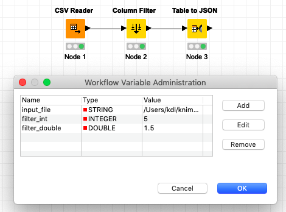

KDL Grammar
===========

KDL serves as a textual representation of KNIME workflows.  The workflows consist of a variety 
of nodes with differing responsibilities, which connect with edges to form a graph.  This 
domain language provides the capability to modify and author workflows to run within KNIME.

Nodes
-----

Listed below demonstrates a simple node definition within KDL. ::

   Nodes {
       (n1): {
           "name": "CSV Reader"
       },
       (n2): {
           "name": "Table to JSON"
       },
       (n3): {
           "name": "Column Reader"
       }
   }

The individual node definitions reside within the ``Nodes { ... }`` section.  Each node 
identifies itself with a unique number prefixed with the letter 'n'.  The example above 
consists of node definitions for n1, n2, and n3.  The properties of each node are defined 
to the right of the colon beside each node id.  KDL uses `JSON <https://www.json.org/>`_ 
for writing node properties.  A functional node definition would consist of more properties, 
but the example above illustrates the syntax required for defining nodes.

Explore the `examples folder <https://github.com/k-descriptor-language/kdl/tree/master/examples>`_ 
of the KDL repository to see fully defined nodes. 

Workflow
--------

A KDL workflow is defined by the connections between nodes in the following format,
where the node_id is a reference to the id of node definition within the ``Nodes {...}``
section above ::

   (<source_node_id>:<source_port>)-->(<dest_node_id>:<dest_port>)

All of the various connections are encapsulated within the ``"connections"`` section of
the ``Workflow {...}`` wrapper. For example the following denotes a simple workflow where the
output of node_1:port_1 is connected to the input of node_2:port_1, whose output is connected
to node_3:port_1 ::

   Workflow {
       "connections": {
           (n1:1)-->(n2:1),
           (n2:1)-->(n3:1)
       }
   }

This example is the representation of the above KDL within the KNIME GUI

.. figure:: images/Workflow1.png
   :align:  center

Nodes may have multiple inports and outports depending on the node's definition but this
is handled simply by updating the source/dest port in the connection definition. In the
following example, node_3 is a Joiner node which has multiple inports ::

   Workflow {
       "connections": {
           (n1:1)-->(n3:1),
           (n2:1)-->(n3:2),
           (n3:1)-->(n4:1)

       }
   }

This example is the representation of the above KDL within the KNIME GUI

Flow Variables
------------------
Flow variables are used in KNIME to parametrize workflows when node settings
need to be determined dynamically.  KDL supports usage and creation of both Global
Flow variables as well as variables exposed from a node settings attribute.

Global Variables
++++++++++++++++
Flow variables can be exposed at the workflow level, allowing those variables to referenced
within any node.  This is accomplished within KDL by the addition of the ``"variables"``
attribute within the ``Workflow {...}`` wrapper.  The value of the ``"variables"`` attribute
is simple a JSON list representation of the global flow variables::

   Workflow {
       "variables": [
           {
               "input_file": "/Users/kdl/knime-workspace/Data/Demographics.csv"
           },
           {
               "filter_int": 5
           },
           {
               "filter_double": 1.5
           }
       ],
       "connections": {
           (n1:1)-->(n2:1),
           (n2:1)-->(n3:1)
       }
   }

This example is the representation of the variables in the above KDL within the KNIME GUI

Variable Connections
++++++++++++++++++++
Flow variables are carried along branches in a workflow via data links (black edges
between nodes) and also via explicit variable links (red edges between nodes).  KDL provides
a user-friendly syntactic sugar for exposing these explicit variable connections within the
``"connections"`` section of the workflow using a tilde-arrow ``~~>`` in the connection
definition. ::

   Workflow {
       "connections": {
           (n1:1)-->(n2:1),
           (n2:1)-->(n3:1),
           (n2)~~>(n3)
       }
   }

This example is the representation of the variable connection in the above KDL within the
KNIME GUI

The port does not need to be specified for variable connections to/from the upper corner of
nodes but there are some nodes (e.g. Quickforms String Input) which allow variable connections
that require a port to be specified. ::

   Workflow {
       "connections": {
           (n1:1)~~>(n2),
       }
   }

This example is the representation of the variable connection in the above KDL within the
KNIME GUI

used_variable and exposed_variable
++++++++++++++++++++++++++++++++++

Metanodes
---------

Parent/Child IDs
++++++++++++++++

Meta In/Out Ports
+++++++++++++++++

Connections
+++++++++++

Wrapped Metanodes
-----------------

WrappedInput/WrappedOut
+++++++++++++++++++++++

